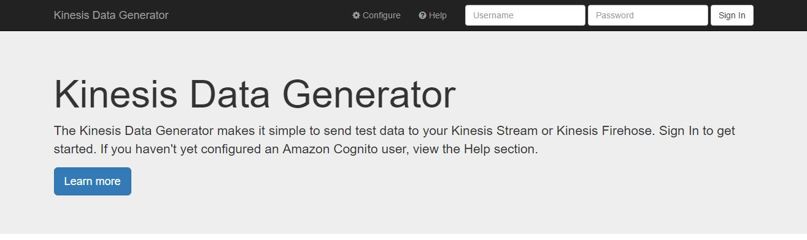

# amazon-kinesis-data-generator

Easily send data to your Kinesis Stream or Kinesis Firehose

* * *
## About
The Amazon Kinesis Data Generator is a UI that simplifies how you send test data to Amazon Kinesis Streams or Amazon Kinesis Firehose.  Using the Amazon Kinesis Data Generator, you can create templates for your data, create random values to use for your data, and save the templates for future use.

## Getting Started
The easiest and recommended approach is to use the Github-hosted version of this project.  The second method is to clone/download this project and host it in your own S3 bucket.

### Using the Github-hosted UI
Because the project is a collection of static HTML and JavaScript, you can use the application without deploying the code into your own AWS account.  However, you *will* need to create an Amazon Cognito User Pool in your account, and create a user in that pool.  A simple CloudFormation template and Lambda function is provided to simplify the creation of the Cognito User Pool and user.

 To get started, go to the hosted [Kinesis Data Generator](https://awslabs.github.io/amazon-kinesis-data-generator/web/producer.html).  Instructions for creating the Cognito user in your account are located in [the application's documentation](https://awslabs.github.io/amazon-kinesis-data-generator/web/help.html).

 

